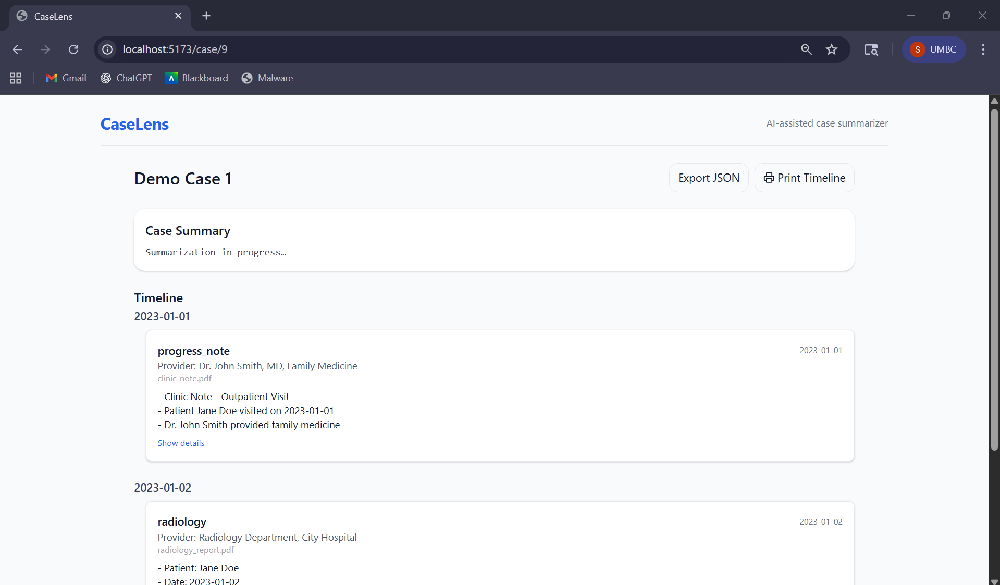
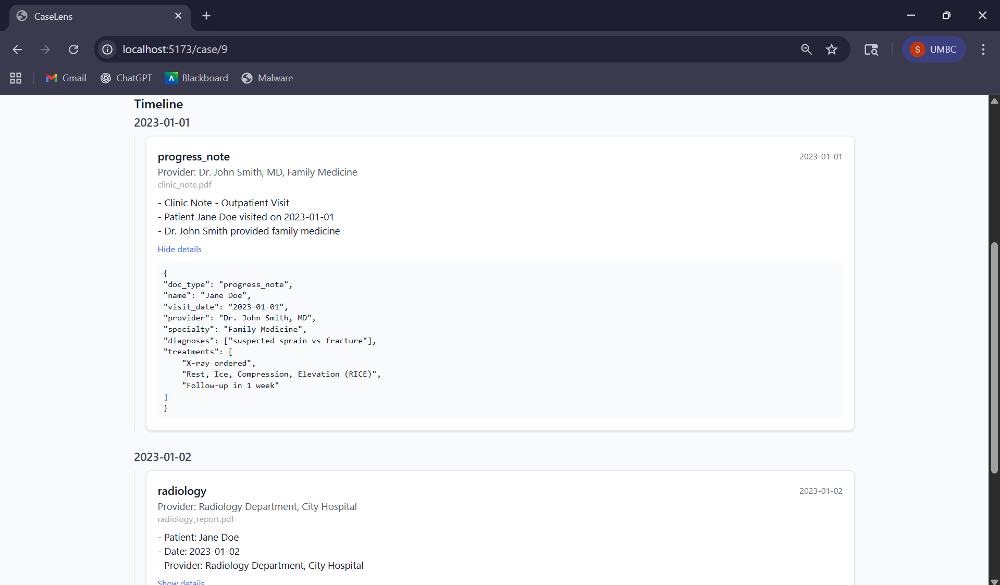
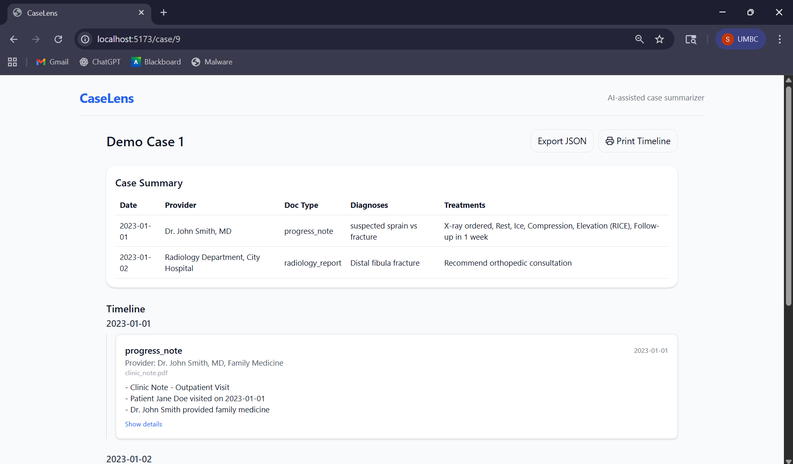

# CaseLens

CaseLens is a full-stack application for managing legal and medical case documents.

It allows professionals to upload PDFs, automatically extracts and summarizes them using AI, and presents a structured case summary with a timeline of events.

## ✨ Features

- **Case Management**

  - Create new cases or add documents to existing ones
  - Rename cases inline (with automatic conflict handling, e.g. `CaseName(1)`)
  - Delete cases with confirmation dialog

- **Document Upload & Processing**

  - Drag-and-drop or file picker for PDFs
  - Duplicate detection to avoid reprocessing the same document
  - AI-powered summarization of each document
  - Case-level summary generated from all included documents

- **Timeline View**

  - Documents grouped by date
  - Displays provider, doc type, filename, and AI highlight
  - Print-friendly view with “Print Timeline” button

- **Frontend**

  - Built with **React + Vite + TypeScript**
  - State management via **React Query**
  - Styling with **TailwindCSS**
  - Inline editing for renaming cases

- **Backend**
  - Built with **FastAPI** (Python)
  - Uses **SQLite** for metadata storage
  - PDF text extraction (OCR support)
  - Background tasks for AI calls
  - API endpoints for case CRUD, uploads, and JSON export

## 🚀 Getting Started

### Prerequisites

Make sure you have installed:

- [Node.js](https://nodejs.org/) (>= 18.x recommended)
- [Python](https://www.python.org/) (>= 3.11)
- [Ollama](https://ollama.com/) installed locally for LLM calls  
  (or configure backend to use a different provider)
- Git

---

### 1. Clone Repository

```bash
git clone https://github.com/yourusername/caselens.git
cd caselens
```

---

### 2. Backend Setup

```bash
cd backend
python -m venv venv

# On Linux/Mac
source venv/bin/activate

# On Windows
venv\Scripts\activate
pip install -r requirements.txt
```

#### Run the FastAPI server:

```bash
uvicorn app.main:app --reload
```

## The backend will run at http://127.0.0.1:8000

### 3. Frontend Setup

```bash
cd frontend
npm install
npm run dev
```

The frontend will run at http://localhost:5173

## 📂 Project Structure

```bash
caselens/
├── backend/
│ ├── app/
│ │ ├── main.py         # FastAPI entrypoint
│ │ ├── models.py       # SQLModel definitions (Case, Doc)
│ │ ├── schemas.py      # Pydantic schemas for API responses
│ │ ├── llm.py          # AI integration with Ollama
│ │ ├── ocr.py          # PDF text extraction
│ │ ├── parse.py        # Heuristics for doc_type, provider, date
│ │ └── utils.py        # Helpers (slugs, hashing, etc.)
│ ├── data/             # SQLite DB + uploaded docs + work dir
│ └── requirements.txt  # Python dependencies
│
├── frontend/
│ ├── src/
│ │ ├── pages/          # React pages (Home, CaseView)
│ │ ├── components/     # Reusable UI components
│ │ ├── hooks/          # React Query hooks
│ │ └── lib/            # API client
│ └── package.json      # Frontend dependencies
│
└── README.md           # Project documentation
```

## 📡 API Overview

- ### `POST /upload`

  - Upload PDFs for a new or existing case
  - Params:
    - `case_name` (str) — required for new case
    - `case_id` (int) — optional for adding docs to existing case
    - `files` (list of PDFs)
  - Response:
    ```json
    { "case_id": 1 }
    ```

- ### `GET /api/case/{case_id}`

  - Get metadata, docs, highlights, and case summary

- ### `GET /api/cases`

  - List all cases (id, name, created_at)

- ### `DELETE /api/case/{case_id}`

  - Delete a case and its associated documents

- ### `PATCH /api/case/{case_id}`

  - Rename a case (frontend sends `{ "name": "New Name" }`)

- ### `GET /export/{case_id}.json`
  - Export JSON snapshot of case (ready for downstream ingestion)

## 🖼️ Sample Screenshots

### Home Page

### Case View





## 📤 Export

You can export a case summary in JSON format:

```bash
curl http://127.0.0.1:8000/export/1.json -o case_1.json
```

The exported file is structured as:

```json
{
  "case": {
    "id": 1,
    "name": "Demo Case",
    "created_at": "2025-09-24 01:07:54"
  },
  "docs": [
    {
      "id": 1,
      "filename": "clinic_note.pdf",
      "date": "2023-01-01",
      "provider": "Dr. John Smith, MD",
      "doc_type": "progress_note"
    }
  ]
}
```

## 🛠️ Development Notes

- Backend uses BackgroundTasks to run LLM calls asynchronously so uploads don’t block.
- If LLM output is malformed (e.g. missing fields), frontend displays `"-"` in summary tables.
- You can extend AI guardrails in `ai_post.py` (e.g., validate dates, doc_type).
- Duplicate PDFs are skipped using a lightweight text hash.

## 👤 Author

CaseLens is developed and maintained by **Sukhbir**

## 📬 Contact

For questions, suggestions, or collaboration opportunities, feel free to reach out at: sukhbir.s3107@gmail.com
